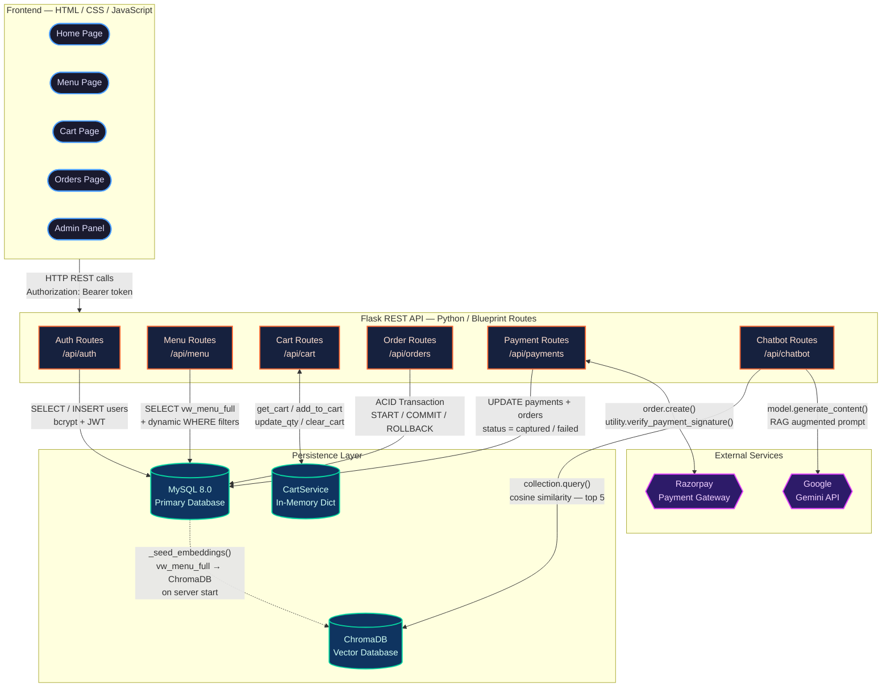
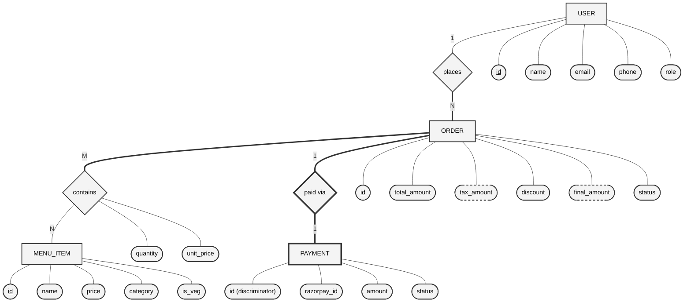

# FoodFlash — Food Ordering Platform

<div align="center">

**A full-stack single-restaurant food ordering platform built as a DBMS Mini Project**

*Covers ER modeling, SQL transactions, vector databases & RAG — all four syllabus units in one project.*

[](https://python.org)
[](https://flask.palletsprojects.com)
[](https://mysql.com)
[](https://razorpay.com)

</div>

---

## Table of Contents

- [About the Project](#about-the-project)
- [Features](#features)
- [Tech Stack](#tech-stack)
- [Architecture](#architecture)
- [Database Design](#database-design)
- [Getting Started](#getting-started)
- [Running the App](#running-the-app)
- [Quick Start](#quick-start-one-command)
- [Test Credentials](#test-credentials)
- [API Reference](#api-reference)
- [DBMS Concepts Demonstrated](#dbms-concepts-demonstrated)
- [Project Structure](#project-structure)

---

## About the Project

**FoodFlash** is a single-restaurant food ordering and management platform for **FoodFlash Kitchen**. Built as a DBMS mini project for SY IoT Semester 4, it demonstrates mastery of database concepts across all four syllabus units:

| Unit | Concept | Implementation |
|------|---------|---------------|
| **Unit I** | ER Modeling, Relational Schema, Normalization | 4-table normalized schema with full ER diagram |
| **Unit II** | SQL (DDL/DML/DCL), Joins, Transactions | Complex queries, stored procedures, ACID-compliant order processing |
| **Unit III** | NoSQL, In-Memory Data Structures | In-memory cart service (Python dict) demonstrating key-value concepts |
| **Unit IV** | Vector Databases, Embeddings, RAG | ChromaDB + Gemini AI chatbot for intelligent menu search |

---

## Features

### Customer Features
- **Smart Menu Search** — Filter by category, veg/non-veg, and keyword search
- **Shopping Cart** — In-memory persistent cart with real-time quantity management
- **Secure Payments** — Razorpay test-mode checkout with success animation
- **Order Tracking** — Real-time order status timeline (Placed > Confirmed > Preparing > Food Ready > Served)
- **Order Cancellation** — ACID-guaranteed cancel + payment refund (before food is prepared)
- **AI Chatbot** — Ask natural language questions like *"Show me veg pizzas under Rs.300"*
- **User Profile** — Manage account info and view order history

### Admin Features
- **Dashboard** — Revenue stats, orders today, active customers, and top-selling items
- **Menu Management** — Full CRUD for menu items with image URLs and category
- **Order Management** — View all orders, update status with color-coded dropdowns
- **Database Management** — View schema info, bulk delete orders/customers with safety confirmations
- **Dedicated Admin Login** — Separate login page with role-based access control

### Authentication
- **JWT-based Auth** — Secure token-based authentication
- **Role-based Access** — Separate flows for customers (`customer`) and administrators (`admin`)
- **Password Hashing** — bcrypt-encrypted password storage

---

## Tech Stack

### Frontend
| Technology | Purpose |
|-----------|---------|
| **HTML5** | Semantic page structure |
| **CSS3** | Custom design system with glassmorphism, animations, dark theme |
| **JavaScript (ES6+)** | DOM manipulation, API integration, Razorpay checkout |

### Backend
| Technology | Purpose |
|-----------|---------|
| **Python 3.10+** | Primary programming language |
| **Flask 3.0** | REST API framework with Blueprint routing |
| **Flask-CORS** | Cross-origin resource sharing |
| **PyJWT** | JSON Web Token authentication |
| **bcrypt** | Password hashing |
| **python-dotenv** | Environment variable management |

### Databases & Storage
| Technology | Purpose | Syllabus Unit |
|-----------|---------|--------------|
| **MySQL 8.0** | Primary relational database — users, orders, menu, payments | Unit I & II |
| **Python dict (in-memory)** | Cart storage — key-value concept demonstration | Unit III |
| **ChromaDB** | Vector database for menu item embeddings | Unit IV |

### External Services
| Technology | Purpose |
|-----------|---------|
| **Razorpay (Test Mode)** | Payment gateway — triggers ACID transaction demo |
| **Google Gemini API** | LLM for RAG-based chatbot responses |

---

## Architecture



---

## Database Design

### Schema Overview

The database follows a **normalized 3NF schema** with 5 tables — no `restaurants` table needed since FoodFlash Kitchen is a single-restaurant system:

| Table | Description |
|-------|-------------|
| `users` | Customer & admin accounts — name, email, phone, role (`customer`/`admin`) |
| `menu_items` | Food items — name, price, category, veg/non-veg, image, availability |
| `orders` | Customer orders — FK to users, total, tax, discount, final amount, status |
| `order_items` | Junction table (order to menu) — quantity, unit_price, computed subtotal |
| `payments` | Razorpay integration — order IDs, signature verification, payment method |

### Views
| View | Description |
|------|-------------|
| `vw_order_details` | JOIN of orders + users + payments — used by admin dashboard |
| `vw_menu_full` | Filtered view of available menu items — used by menu API |

### Order Status Flow

```
placed -> confirmed -> preparing -> food_prepared -> served
   +-------------------> cancelled (only before food_prepared)
```

### Entity-Relationship Diagram (Chen Notation)



## How It Works — Technical Detail

---

### 1. User Registration & Login

**Route:** `POST /api/auth/register` and `POST /api/auth/login`
**File:** `backend/routes/auth_routes.py`

**Registration flow:**
1. Client sends `{ name, email, password, phone }` as JSON.
2. `register()` calls `execute_query("SELECT id FROM users WHERE email = %s")` to check for duplicates.
3. If unique, `hash_password(password)` runs `bcrypt.hashpw(password.encode(), bcrypt.gensalt(12))` to produce a 60-character hash.
4. `execute_query("INSERT INTO users (name, email, password_hash, phone) VALUES (%s, %s, %s, %s)")` inserts the record. Role defaults to `customer`.
5. `generate_token(user_id, role)` creates a signed JWT using `PyJWT` with a 24-hour expiry and returns it.

**Login flow:**
1. Client sends `{ email, password }`.
2. `login()` fetches the full user row: `SELECT * FROM users WHERE email = %s`.
3. `verify_password(password, user['password_hash'])` runs `bcrypt.checkpw()`. If it returns `False`, a 401 is returned.
4. On success, a JWT token is generated containing `user_id` and `role` in the payload and returned to the client.
5. The token is stored in `localStorage` on the frontend (`foodflash_token`) and sent as `Authorization: Bearer <token>` on all subsequent requests.

**Token verification:** Every protected route uses the `@token_required` decorator (`utils/auth.py`) which calls `jwt.decode(token, JWT_SECRET, algorithms=['HS256'])` and injects `request.user_id` and `request.user_role`.

---

### 2. Menu Browsing

**Route:** `GET /api/menu?category=&veg=&search=`
**File:** `backend/routes/menu_routes.py` — function `get_menu()`

**Data retrieval flow:**
1. `get_menu()` reads optional query parameters: `category`, `veg` (true/false), `search`.
2. Dynamically builds a parameterized SQL query starting from `SELECT * FROM vw_menu_full WHERE 1=1`.
3. For each active filter, appends a clause:
   - Category: `AND category = %s`
   - Veg filter: `AND is_veg = %s`
   - Search: `AND name LIKE %s` (uses `%search%` for partial match)
4. `execute_query(query, tuple(params))` runs the final query against the `vw_menu_full` database view.
5. `vw_menu_full` is a MySQL view defined in `procedures.sql` that filters only `is_available = TRUE` items from `menu_items`.
6. Results are returned as a JSON array to the frontend, which renders each item as a card in `menu.js`.

**Single item:** `GET /api/menu/:id` calls `SELECT * FROM vw_menu_full WHERE id = %s`.

---

### 3. Shopping Cart (In-Memory Key-Value Store)

**Route:** `GET/POST/PUT/DELETE /api/cart`
**File:** `backend/services/cart_service.py` — class `CartService`

**Storage structure:**
```
CartService._store = {
    "cart:3": {
        "7":  { "id": 7, "name": "Butter Chicken", "price": 349, "qty": 2 },
        "12": { "id": 12, "name": "Garlic Naan",    "price": 49,  "qty": 3 }
    },
    "cart:5": { ... }
}
```

The key is built by `_key(user_id)` which returns `f"cart:{user_id}"` — the same namespacing pattern as Redis `HSET`.

**Operations:**
- `get_cart(user_id)` — returns `list(_store.get("cart:<id>", {}).values())`
- `add_to_cart(user_id, item_id, quantity, item_data)` — if item already exists, increments `qty`; otherwise inserts new entry.
- `update_quantity(user_id, item_id, quantity)` — directly sets `_store[key][sid]['qty'] = quantity`
- `remove_from_cart(user_id, item_id)` — runs `del _store[key][sid]`
- `clear_cart(user_id)` — runs `del _store[key]` (called automatically after order is placed)

The `cart_routes.py` uses `@token_required` to extract `request.user_id`, then calls the appropriate `CartService` method.

---

### 4. Order Placement (ACID Transaction)

**Route:** `POST /api/orders`
**File:** `backend/routes/order_routes.py` — function `place_order()`

**Step-by-step transaction:**
```
Client sends: { items: [{menu_item_id, quantity, unit_price}], discount }

conn.start_transaction()   <- BEGIN

1. Calculate totals:
   total        = sum(quantity * unit_price for each item)
   tax_amount   = round(total * 0.05, 2)     <- 5% GST
   final_amount = total + tax - discount

2. INSERT INTO orders (user_id, total_amount, tax_amount, discount, final_amount, status='placed')
   order_id = cursor.lastrowid

3. For each item:
   INSERT INTO order_items (order_id, menu_item_id, quantity, unit_price)

4. INSERT INTO payments (order_id, amount, status='created')

conn.commit()              <- COMMIT (all 3 tables atomically)

On any exception:
conn.rollback()            <- ROLLBACK (nothing is saved)
```

After a successful commit, `cart_service.clear_cart(user_id)` is called to wipe the in-memory cart.

**Trigger enforcement:** The `trg_validate_order_amount` MySQL trigger fires on `INSERT INTO orders`. If `final_amount <= 0`, it raises `SQLSTATE '45000'` which causes the Python code's `except` block to `rollback()`.

---

### 5. Payment Flow (Razorpay)

**Routes:** `POST /api/payments/create` and `POST /api/payments/verify`
**File:** `backend/routes/payment_routes.py`

**Create payment:**
1. `create_payment()` calls `razorpay_client.order.create({ amount: int(rupees * 100), currency: 'INR', receipt: 'order_<id>' })`.
   - Amount is converted to **paise** (1 INR = 100 paise) as required by the API.
2. The returned `razorpay_order_id` is saved: `UPDATE payments SET razorpay_order_id = %s WHERE order_id = %s`.
3. `razorpay_key_id` is returned to the frontend to open the Razorpay checkout widget.

**Verify payment (ACID):**
1. `verify_payment()` receives `{ razorpay_payment_id, razorpay_order_id, razorpay_signature, order_id }`.
2. `razorpay_client.utility.verify_payment_signature(...)` — computes HMAC-SHA256 over `order_id + "|" + payment_id` using the Razorpay secret. Raises `SignatureVerificationError` if tampered.
3. `razorpay_client.payment.fetch(razorpay_payment_id)` fetches full payment details to get `method` (card/UPI/netbanking).
4. ACID transaction:
   ```
   conn.start_transaction()
   UPDATE payments SET razorpay_payment_id, razorpay_signature, status='captured', method WHERE order_id
   UPDATE orders SET status='confirmed' WHERE id
   conn.commit()
   ```
5. On `SignatureVerificationError`:
   ```
   UPDATE payments SET status='failed'
   UPDATE orders SET status='cancelled'
   conn.commit()
   ```

---

### 6. Order Cancellation (ACID + Row Locking)

**Route:** `PUT /api/orders/:id/cancel`
**File:** `backend/routes/order_routes.py` — function `cancel_order()`

1. `conn.start_transaction()` begins.
2. `SELECT id, status, user_id FROM orders WHERE id = %s FOR UPDATE` — acquires a **row-level lock** on the order to prevent race conditions (e.g. two cancel requests at the same time).
3. Business rule check: status must be in `['placed', 'confirmed', 'preparing']`. The `trg_prevent_invalid_cancel` trigger also enforces this at the DB layer.
4. If allowed:
   ```
   UPDATE orders SET status = 'cancelled' WHERE id = %s
   UPDATE payments SET status = 'refunded' WHERE order_id = %s
   conn.commit()
   ```
5. On failure: `conn.rollback()`.

---

### 7. Admin Dashboard Stats

**Route:** `GET /api/admin/stats`
**File:** `backend/routes/admin_routes.py` — function `get_stats()`

Runs 4 independent SQL queries:
```sql
-- Total revenue (excludes cancelled orders)
SELECT COALESCE(SUM(final_amount), 0) AS total FROM orders WHERE status != 'cancelled'

-- Orders placed today
SELECT COUNT(*) AS count FROM orders WHERE DATE(created_at) = CURDATE()

-- Unique customers who have ordered
SELECT COUNT(DISTINCT user_id) AS count FROM orders

-- Top 5 best-selling items
SELECT mi.name, mi.image_url, SUM(oi.quantity) AS total_sold
FROM order_items oi
JOIN menu_items mi ON oi.menu_item_id = mi.id
GROUP BY mi.id, mi.name, mi.image_url
ORDER BY total_sold DESC LIMIT 5
```

**All orders view:** `get_all_orders()` queries the `vw_order_details` view, and uses `GROUP_CONCAT(CONCAT(mi.name, ' x', oi.quantity) SEPARATOR ', ')` to produce a single readable string like `"Butter Chicken x2, Garlic Naan x3"` per order row.

**Menu CRUD:**
- `add_menu_item()` — `INSERT INTO menu_items (name, description, price, category, is_veg, image_url)`
- `update_menu_item()` — dynamically builds `UPDATE menu_items SET field1=%s, field2=%s WHERE id=%s` based on which keys are present in the request JSON.
- `delete_menu_item()` — `DELETE FROM menu_items WHERE id = %s`

---

### 8. AI Chatbot — RAG Pipeline (ChromaDB + Gemini)

**Route:** `POST /api/chatbot`
**File:** `backend/services/rag_service.py` — class `RAGService`

**Step 1 — Startup: Data Ingestion & Vectorization**

When `RAGService.__init__()` runs at server startup:
1. `chromadb.PersistentClient(path=Config.CHROMA_PERSIST_DIR)` opens (or creates) a local ChromaDB database at `./chroma_data/`.
2. `get_or_create_collection(name="menu_items")` gets or creates a named collection.
3. If `collection.count() == 0`, `_seed_embeddings()` is called.

Inside `_seed_embeddings()`:
1. Fetches all available items: `execute_query("SELECT * FROM vw_menu_full")`.
2. For each item, builds a plain-text document string:
   ```
   "Butter Chicken - Creamy tomato-based curry with tender chicken pieces |
    Category: north-indian | Price: Rs.349 | Non-Vegetarian"
   ```
3. Builds parallel lists: `documents[]`, `metadatas[]` (price, is_veg, category, item_id), `ids[]` (e.g. `"menu_7"`).
4. Calls `collection.add(documents=documents, metadatas=metadatas, ids=ids)`.
   - ChromaDB internally sends each document string to its **embedding model** (default: `all-MiniLM-L6-v2` via `sentence-transformers`).
   - Each document is converted to a **384-dimensional float vector**.
   - Vectors are stored in ChromaDB's local SQLite + HNSW index for fast nearest-neighbor lookup.

**Step 2 — Query: Semantic Search + LLM Generation**

When a user sends a message via the chatbot, `RAGService.query(user_query, n_results=5)` runs:

1. `collection.query(query_texts=[user_query], n_results=5)`:
   - ChromaDB embeds the query text into a vector using the same model.
   - Performs **cosine similarity search** across all stored menu item vectors using the HNSW index.
   - Returns the top 5 closest document strings and their metadata.

2. Retrieved documents are joined into a `context` string.

3. The context + user query are injected into a structured prompt:
   ```
   "You are FoodFlash AI, a friendly food ordering assistant.
    Based on these menu items from our database:
    <context>
    Answer the customer's question: "<user_query>"
    Rules: Be helpful, suggest dishes with prices, keep response concise..."
   ```

4. `self.model.generate_content(prompt)` calls the **Gemini API** (`gemini-flash-latest`) with the augmented prompt.

5. Gemini generates a grounded, conversational reply and `response.text` is returned to the frontend.

**Fallback:** If `GEMINI_API_KEY` is not set or the API call fails, `_fallback_response(metadatas)` returns a simple list of the top matched item names and prices from the ChromaDB metadata directly — no LLM needed.


## Getting Started

### Prerequisites

- **Python 3.10+** — [Download](https://python.org)
- **MySQL 8.0** — [Download](https://dev.mysql.com/downloads/)
- **Git** — [Download](https://git-scm.com)

### Installation

```bash
# 1. Clone the repository
git clone https://github.com/your-username/Food_Ordering_Platform.git
cd Food_Ordering_Platform

# 2. Set up the MySQL database (run in order)
mysql -u root -p < database/schema.sql
mysql -u root -p foodflash < database/procedures.sql
mysql -u root -p foodflash < database/seed_data.sql

# 3. Create a virtual environment & install dependencies
cd backend
python -m venv venv

# Activate the virtual environment:
# On Windows (PowerShell):
.\venv\Scripts\Activate.ps1
# On Windows (Command Prompt):
venv\Scripts\activate
# On macOS/Linux:
source venv/bin/activate

# Install dependencies
pip install -r requirements.txt

# 4. Configure environment variables
copy .env.example .env
# Edit .env with your MySQL password, Razorpay keys, Gemini API key
```

### Environment Variables (`.env`)

| Variable | Description | Example |
|----------|-------------|---------|
| `MYSQL_PASSWORD` | Your MySQL root password | `your_password` |
| `RAZORPAY_KEY_ID` | Razorpay test key ID | `rzp_test_xxxxxxxxxxxx` |
| `RAZORPAY_KEY_SECRET` | Razorpay test secret | `xxxxxxxxxxxxxxxxxxxxxxxx` |
| `GEMINI_API_KEY` | Google Gemini API key (for chatbot) | `AIza...` |

---

## Running the App

```bash
# Navigate to the backend directory
cd backend

# Activate the virtual environment
.\venv\Scripts\Activate.ps1        # Windows PowerShell
# or: venv\Scripts\activate        # Windows CMD
# or: source venv/bin/activate     # macOS/Linux

# Start the Flask development server
python app.py
```

The app will be running at: **http://localhost:5000**

> Flask serves both the API and the frontend static files — no separate server needed.

---

## Quick Start (One Command)

A batch script is included for Windows users:

```bash
# From the project root directory
start_servers.bat
```

This launches the Flask backend in a new terminal window. Access at **http://localhost:5000**.

---

## Test Credentials

### Admin Account

| Email | Password | Login URL |
|-------|----------|-----------|
| `admin@test.com` | `admin1234` | `http://localhost:5000/admin-login.html` |

> Admin has access to the dashboard, order management, menu CRUD, and data management tools.

### Customer Accounts

| Name | Email | Password | Login URL |
|------|-------|----------|-----------|
| Rahul Sharma | `rahul@test.com` | `test1234` | `http://localhost:5000/login.html` |
| Priya Mehta | `priya@test.com` | `test1234` | `http://localhost:5000/login.html` |
| Amit Kumar | `amit@test.com` | `test1234` | `http://localhost:5000/login.html` |
| Sneha Reddy | `sneha@test.com` | `test1234` | `http://localhost:5000/login.html` |
| Vikram Singh | `vikram@test.com` | `test1234` | `http://localhost:5000/login.html` |

### Razorpay Test Card

```
Card Number: 4111 1111 1111 1111
Expiry:      Any future date
CVV:         Any 3 digits
OTP:         1234
```

---

## API Reference

### Authentication (`/api/auth`)

| Method | Endpoint | Requires Auth | Description |
|--------|---------|---------------|-------------|
| `POST` | `/api/auth/register` | No | Register a new customer |
| `POST` | `/api/auth/login` | No | Login and receive JWT token |
| `GET` | `/api/auth/profile` | Yes | Get current user profile |
| `PUT` | `/api/auth/profile` | Yes | Update user profile |

### Menu (`/api`)

| Method | Endpoint | Requires Auth | Description |
|--------|---------|---------------|-------------|
| `GET` | `/api/menu` | No | List menu items (`?category=`, `?veg=`, `?search=`) |
| `GET` | `/api/menu/:id` | No | Get a single menu item |
| `GET` | `/api/public/stats` | No | Public platform stats (items, orders, customers) |

### Cart (`/api/cart`)

| Method | Endpoint | Requires Auth | Description |
|--------|---------|---------------|-------------|
| `GET` | `/api/cart` | Yes | Get current cart items |
| `POST` | `/api/cart` | Yes | Add item to cart |
| `PUT` | `/api/cart/:item_id` | Yes | Update item quantity |
| `DELETE` | `/api/cart/:item_id` | Yes | Remove item from cart |
| `DELETE` | `/api/cart/clear` | Yes | Clear entire cart |

### Orders (`/api/orders`)

| Method | Endpoint | Requires Auth | Description |
|--------|---------|---------------|-------------|
| `POST` | `/api/orders` | Yes | Place a new order (ACID transaction) |
| `GET` | `/api/orders` | Yes | Get user's order history with items |
| `GET` | `/api/orders/:id` | Yes | Get a single order detail |
| `PUT` | `/api/orders/:id/cancel` | Yes | Cancel order + refund payment (ACID) |

### Payments (`/api/payments`)

| Method | Endpoint | Requires Auth | Description |
|--------|---------|---------------|-------------|
| `POST` | `/api/payments/create` | Yes | Create Razorpay payment order |
| `POST` | `/api/payments/verify` | Yes | Verify Razorpay signature (ACID update) |

### Admin (`/api/admin`) — Admin role required

| Method | Endpoint | Description |
|--------|---------|-------------|
| `GET` | `/api/admin/stats` | Dashboard stats (revenue, orders today, customers, top items) |
| `GET` | `/api/admin/orders` | All orders with items summary |
| `PUT` | `/api/admin/orders/:id/status` | Update order status |
| `POST` | `/api/admin/menu` | Add new menu item |
| `PUT` | `/api/admin/menu/:id` | Update menu item |
| `DELETE` | `/api/admin/menu/:id` | Delete menu item |
| `DELETE` | `/api/admin/clear/orders` | Delete all orders (danger zone) |
| `DELETE` | `/api/admin/clear/customers` | Delete all customer accounts (danger zone) |

### AI Chatbot (`/api/chatbot`)

| Method | Endpoint | Requires Auth | Description |
|--------|---------|---------------|-------------|
| `POST` | `/api/chatbot` | No | Send natural language query, get RAG response |

---

## DBMS Concepts Demonstrated

### Unit I — Database Design
- **ER Diagram** — entities, attributes, relationships, cardinality (`database/er_diagram.md`)
- **Relational Schema** — mapping from ER to normalized tables
- **3NF Normalization** — all tables free of transitive dependencies
- **Keys** — Primary keys, foreign keys (`ON DELETE CASCADE`), unique constraints

### Unit II — SQL & Transactions
- **DDL** — `CREATE TABLE`, indexes, check constraints, enum types
- **DML** — `INSERT`, `UPDATE`, `DELETE`, `SELECT` with complex conditions
- **Joins** — `INNER JOIN`, `LEFT JOIN` across multiple tables
- **Aggregate Functions** — `COUNT`, `SUM`, `AVG`, `GROUP BY`, `GROUP_CONCAT`
- **Stored Procedures** — `place_order()`, `complete_payment()`, `cancel_order()`, `update_order_status()`, `get_dashboard_stats()`
- **Triggers** — `trg_prevent_invalid_cancel`, `trg_validate_order_amount`
- **Views** — `vw_order_details`, `vw_menu_full`
- **ACID Transactions** — `START TRANSACTION`, `COMMIT`, `ROLLBACK`, `SELECT FOR UPDATE` (row-level locking)
- **Indexing** — B-tree indexes on `email`, `role`, `status`, `created_at`

### Unit III — NoSQL / In-Memory Concepts
- **Key-Value Store Concept** — Cart stored as `{ "cart:<user_id>": { "<item_id>": {...} } }` in Python dict
- **Session-scoped Storage** — Cart persists across requests within a server session
- **NoSQL vs SQL Trade-offs** — Speed of in-memory access vs ACID durability of MySQL

### Unit IV — Advanced Topics
- **Vector Database** — ChromaDB for storing menu item embeddings
- **Text Embeddings** — Menu descriptions converted to mathematical vectors
- **RAG Pipeline** — Retrieval-Augmented Generation with ChromaDB + Gemini
- **Semantic Search** — Find menu items using cosine similarity (not just keyword match)

---

## Project Structure

```
Food_Ordering_Platform/
+-- README.md                        # This file
+-- start_servers.bat                # One-click startup script (Windows)
|
+-- frontend/                        # Client-side code
|   +-- index.html                   # Landing page
|   +-- menu.html                    # Menu browsing & search
|   +-- cart.html                    # Shopping cart + Razorpay checkout
|   +-- orders.html                  # Order history & status tracking
|   +-- login.html                   # Customer login
|   +-- register.html                # Customer registration
|   +-- admin.html                   # Admin dashboard
|   +-- admin-login.html             # Admin login page
|   +-- profile.html                 # User profile management
|   +-- css/
|   |   +-- styles.css               # Design system (glassmorphism, dark theme)
|   +-- js/
|       +-- app.js                   # Core app logic, shared utilities, cart helpers
|       +-- auth.js                  # Login/register, JWT management
|       +-- menu.js                  # Menu browsing and search
|       +-- cart.js                  # Cart management, Razorpay checkout
|       +-- orders.js                # Order history and cancel
|       +-- admin.js                 # Admin dashboard, stats, order & menu management
|       +-- chatbot.js               # AI chatbot UI and API integration
|
+-- backend/                         # Flask REST API
|   +-- app.py                       # Entry point — registers blueprints, serves frontend
|   +-- config.py                    # Configuration from environment variables
|   +-- requirements.txt             # Python dependencies
|   +-- .env.example                 # Environment variable template
|   +-- routes/                      # API route handlers (Blueprints)
|   |   +-- auth_routes.py           # /api/auth — login, register, profile
|   |   +-- menu_routes.py           # /api/menu — menu listing, search
|   |   +-- cart_routes.py           # /api/cart — in-memory cart CRUD
|   |   +-- order_routes.py          # /api/orders — place, list, cancel (ACID)
|   |   +-- payment_routes.py        # /api/payments — Razorpay create + verify
|   |   +-- admin_routes.py          # /api/admin — stats, orders, menu CRUD
|   |   +-- chatbot_routes.py        # /api/chatbot — RAG AI chatbot
|   +-- services/                    # Business logic layer
|   |   +-- cart_service.py          # In-memory cart (key-value store concept)
|   |   +-- rag_service.py           # ChromaDB + Gemini RAG pipeline
|   |   +-- razorpay_service.py      # Razorpay payment integration stub
|   +-- utils/                       # Helpers and middleware
|       +-- auth.py                  # JWT + bcrypt, token_required, admin_required
|       +-- db.py                    # MySQL connection pool management
|
+-- database/                        # SQL scripts
|   +-- schema.sql                   # DDL — 5 tables (users, menu_items, orders, order_items, payments)
|   +-- procedures.sql               # Stored procedures, triggers (x2), views (x2)
|   +-- seed_data.sql                # Sample data — 6 users, 26 menu items, 4 orders
|   +-- er_diagram.md                # ER diagram (Mermaid)
|   +-- README.md                    # Database documentation
|
+-- docs/
    +-- architecture.md              # System architecture & DBMS syllabus mapping
```

---

## License

This project is built for academic purposes as part of the **DBMS Mini Project — SY IoT, Semester 4**.

---

<div align="center">

**Built with Flask, MySQL & AI**

*FoodFlash Kitchen — Order Smart, Eat Happy*

</div>
