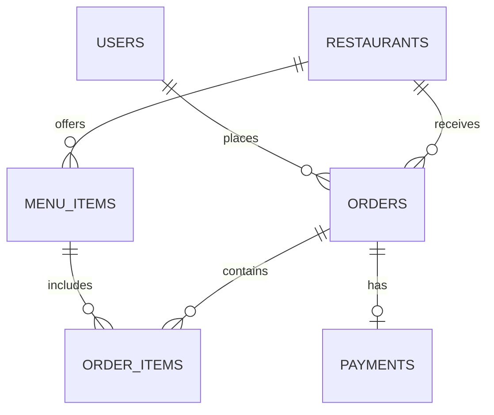

# FoodFlash — Database Documentation

> **Engine:** MySQL 8.0 with InnoDB (ACID-compliant)
> **Normalization:** 3NF (Third Normal Form)
> **Tables:** 6 | **Views:** 2 | **Stored Procedures:** 4 | **Triggers:** 2

---

## 📊 Schema Overview

| # | Table | Description | Primary Key | Foreign Keys |
|---|-------|-------------|-------------|--------------|
| 1 | `users` | Customer and admin accounts | `id` | — |
| 2 | `restaurants` | Single restaurant configuration | `id` | — |
| 3 | `menu_items` | Food items on the menu | `id` | `restaurant_id → restaurants.id` |
| 4 | `orders` | Customer orders with status lifecycle | `id` | `user_id → users.id`, `restaurant_id → restaurants.id` |
| 5 | `order_items` | Junction table linking orders ↔ menu items | `id` | `order_id → orders.id`, `menu_item_id → menu_items.id` |
| 6 | `payments` | Razorpay payment records per order | `id` | `order_id → orders.id` |

### Order Status Flow

```
placed → confirmed → preparing → food_prepared → served
   └──────────────────→ cancelled (only before food_prepared)
```

---

## 🔒 ACID Properties

This database strictly follows all four **ACID properties** using InnoDB transactions:

### Atomicity
> All operations in a transaction succeed together, or none of them take effect.

- The `place_order` stored procedure wraps **INSERT into orders + INSERT into order_items + INSERT into payments** inside a single `START TRANSACTION` / `COMMIT` block.
- If any step fails, the `EXIT HANDLER FOR SQLEXCEPTION` executes a full `ROLLBACK`, leaving the database unchanged.
- The Flask backend (`order_routes.py`) also uses `conn.start_transaction()` + `conn.rollback()` for the same guarantee.

### Consistency
> The database always transitions from one valid state to another. Invalid data is rejected.

- **Trigger `trg_validate_order_amount`**: Rejects any order where `final_amount <= 0`.
- **Trigger `trg_prevent_invalid_cancel`**: Blocks cancelling an order after `food_prepared` or `served`.
- **CHECK constraints**: `price > 0` on menu_items, `quantity > 0` on order_items.
- **FOREIGN KEY constraints**: Enforce referential integrity across all 6 tables.
- **UNIQUE constraints**: `users.email` is unique; `payments.order_id` is unique (one payment per order).
- **ENUM types**: `orders.status` only allows valid values (`placed`, `confirmed`, `preparing`, `food_prepared`, `served`, `cancelled`).

### Isolation
> Concurrent transactions do not interfere with each other.

- InnoDB uses **row-level locking** by default with `REPEATABLE READ` isolation level.
- When two users place orders simultaneously, each transaction operates on its own rows without conflict.

### Durability
> Once a transaction is committed, the data persists even after a system crash.

- `COMMIT` at the end of every stored procedure ensures changes are flushed to InnoDB's redo log.
- InnoDB's doublewrite buffer prevents partial page writes during crashes.

---

## ⚙️ Stored Procedures

| Procedure | Purpose | ACID Role |
|-----------|---------|-----------|
| `place_order()` | Atomically creates order + order items + payment record from JSON | Atomicity + Durability |
| `complete_payment()` | Updates payment status and order status together after Razorpay verification | Atomicity + Consistency |
| `cancel_order()` | Cancels order + refunds payment atomically (only before food is prepared) | Atomicity + Consistency |
| `update_order_status()` | Moves an order through the lifecycle (placed → confirmed → preparing → food_prepared → served) | Consistency |
| `get_dashboard_stats()` | Complex aggregate queries: revenue, order count, top items (JOIN + GROUP BY) | Read-only |

### Example: `place_order` Transaction Flow
```
START TRANSACTION
  ├── INSERT INTO orders (placeholder amounts)
  ├── LOOP: INSERT INTO order_items (for each item)
  ├── CALCULATE tax (5% GST) and final_amount
  ├── UPDATE orders SET amounts
  └── INSERT INTO payments (status = 'created')
COMMIT   ← All 3 tables updated atomically
```
If any step fails → `ROLLBACK` → no partial data left behind.

---

## 🔫 Triggers

| Trigger | Event | Table | Rule |
|---------|-------|-------|------|
| `trg_prevent_invalid_cancel` | BEFORE UPDATE | `orders` | Cannot cancel after status reaches `food_prepared` or `served` |
| `trg_validate_order_amount` | BEFORE INSERT | `orders` | Rejects orders with `final_amount <= 0` |

---

## 👁️ Views

| View | Description |
|------|-------------|
| `vw_order_details` | JOIN of orders + users + restaurants + payments — used by admin dashboard |
| `vw_menu_full` | JOIN of menu_items + restaurants — used by the menu page API |

---

## 📁 Files in this Directory

| File | Purpose |
|------|---------|
| `schema.sql` | CREATE TABLE statements for all 6 tables |
| `procedures.sql` | Stored procedures, triggers, and views |
| `seed_data.sql` | Sample restaurant and menu item data |
| `README.md` | This documentation |

---

## 🚀 How to Set Up

```powershell
# 1. Create database and tables
Get-Content database\schema.sql | mysql -u root -p

# 2. Create procedures, triggers, and views
Get-Content database\procedures.sql | mysql -u root -p

# 3. Load sample data (restaurant + menu items)
Get-Content database\seed_data.sql | mysql -u root -p
```

---

## 🗺️ ER Diagram


