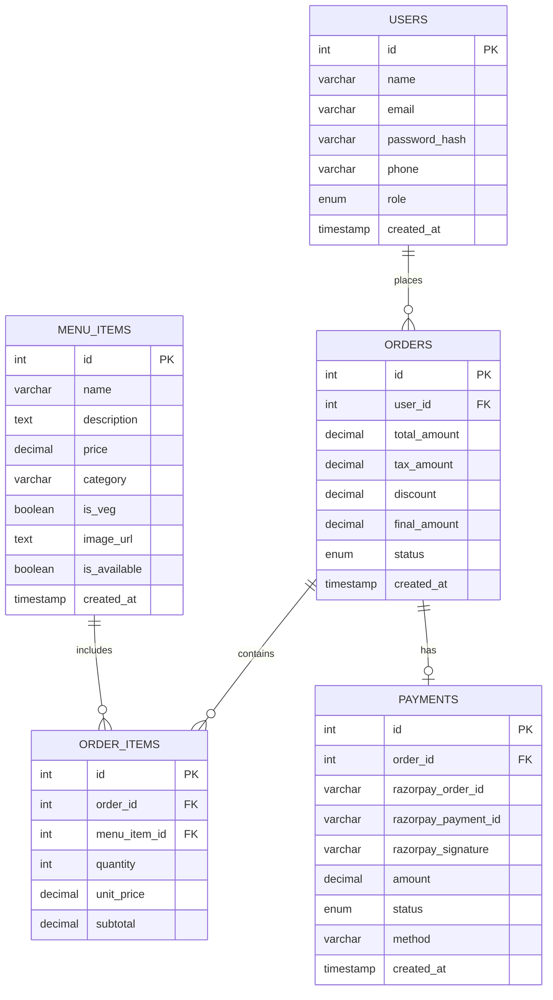

# FoodFlash — Database Documentation

> **Restaurant:** FoodFlash Kitchen (single-restaurant system)
> **Engine:** MySQL 8.0 with InnoDB (ACID-compliant)
> **Normalization:** 3NF (Third Normal Form)
> **Tables:** 5 | **Views:** 2 | **Stored Procedures:** 5 | **Triggers:** 2

---

## Schema Overview

| # | Table | Description | Primary Key | Foreign Keys |
|---|-------|-------------|-------------|--------------|
| 1 | `users` | Customer and admin accounts | `id` | — |
| 2 | `menu_items` | Food items on the menu | `id` | — |
| 3 | `orders` | Customer orders with status lifecycle | `id` | `user_id -> users.id` |
| 4 | `order_items` | Junction table linking orders to menu items | `id` | `order_id -> orders.id`, `menu_item_id -> menu_items.id` |
| 5 | `payments` | Razorpay payment records per order | `id` | `order_id -> orders.id` |

> There is no `restaurants` table — this is a single-restaurant system (FoodFlash Kitchen).

### Order Status Flow

```
placed -> confirmed -> preparing -> food_prepared -> served
   +--(only before food_prepared)--> cancelled
```

---

## ACID Properties

### Atomicity
- `place_order` wraps INSERT into orders + order_items + payments in a single `START TRANSACTION / COMMIT`.
- On failure, `EXIT HANDLER FOR SQLEXCEPTION` executes `ROLLBACK`.

### Consistency
- **Trigger `trg_validate_order_amount`**: Rejects orders where `final_amount <= 0`.
- **Trigger `trg_prevent_invalid_cancel`**: Blocks cancel after `food_prepared` or `served`.
- **CHECK constraints**: `price > 0` on menu_items, `quantity > 0` on order_items.
- **FOREIGN KEY constraints**: Referential integrity with `ON DELETE CASCADE`.
- **UNIQUE constraints**: `users.email`, `payments.order_id`.
- **ENUM types**: `orders.status` only allows valid state values.

### Isolation
- InnoDB row-level locking with `REPEATABLE READ` isolation level.
- `cancel_order` uses `SELECT ... FOR UPDATE` to prevent race conditions.

### Durability
- `COMMIT` flushes changes to InnoDB's redo log after every procedure.

---

## Stored Procedures

| Procedure | Purpose | ACID Role |
|-----------|---------|-----------|
| `place_order(p_user_id, p_items_json, p_discount)` | Creates order + order items + payment atomically | Atomicity + Durability |
| `complete_payment(p_order_id, p_payment_id, p_signature, p_method)` | Updates payment + order status after Razorpay verification | Atomicity + Consistency |
| `cancel_order(p_order_id, p_user_id)` | Cancels order + refunds payment (blocked after food_prepared) | Atomicity + Consistency |
| `update_order_status(p_order_id, p_status)` | Moves order through lifecycle (admin use) | Consistency |
| `get_dashboard_stats()` | Aggregate queries: revenue, order count, top items | Read-only |

### Example: `place_order` Transaction Flow

```
START TRANSACTION
  +-- INSERT INTO orders
  +-- LOOP: INSERT INTO order_items (per item)
  +-- CALCULATE: tax (5% GST), final_amount
  +-- UPDATE orders SET amounts
  +-- INSERT INTO payments (status = 'created')
COMMIT   <- All 3 tables updated atomically
```

If any step fails -> ROLLBACK -> no partial data left behind.

---

## Triggers

| Trigger | Event | Table | Rule |
|---------|-------|-------|------|
| `trg_prevent_invalid_cancel` | BEFORE UPDATE | `orders` | Cannot cancel after `food_prepared` or `served` |
| `trg_validate_order_amount` | BEFORE INSERT | `orders` | Rejects orders with `final_amount <= 0` |

---

## Views

| View | Description | Used By |
|------|-------------|---------|
| `vw_order_details` | JOIN of orders + users + payments | Admin dashboard (`/api/admin/orders`) |
| `vw_menu_full` | Filtered view of available menu items | Menu API (`/api/menu`) |

---

## Files in this Directory

| File | Purpose |
|------|---------|
| `schema.sql` | DDL — CREATE TABLE for all 5 tables + indexes |
| `procedures.sql` | Stored procedures (x5), triggers (x2), views (x2) |
| `seed_data.sql` | Sample data — 6 users, 26 menu items, 4 orders |
| `er_diagram.md` | ER diagram in Mermaid format |
| `README.md` | This documentation |

---

## How to Set Up

```cmd
:: Windows Command Prompt

:: 1. Drop + recreate database
mysql -u root -pYOUR_PASSWORD -e "DROP DATABASE IF EXISTS foodflash; CREATE DATABASE foodflash CHARACTER SET utf8mb4 COLLATE utf8mb4_unicode_ci;"

:: 2. Create tables
mysql -u root -pYOUR_PASSWORD foodflash < database\schema.sql

:: 3. Create procedures, triggers, and views
mysql -u root -pYOUR_PASSWORD foodflash < database\procedures.sql

:: 4. Load sample data
mysql -u root -pYOUR_PASSWORD foodflash < database\seed_data.sql
```

---

## ER Diagram


