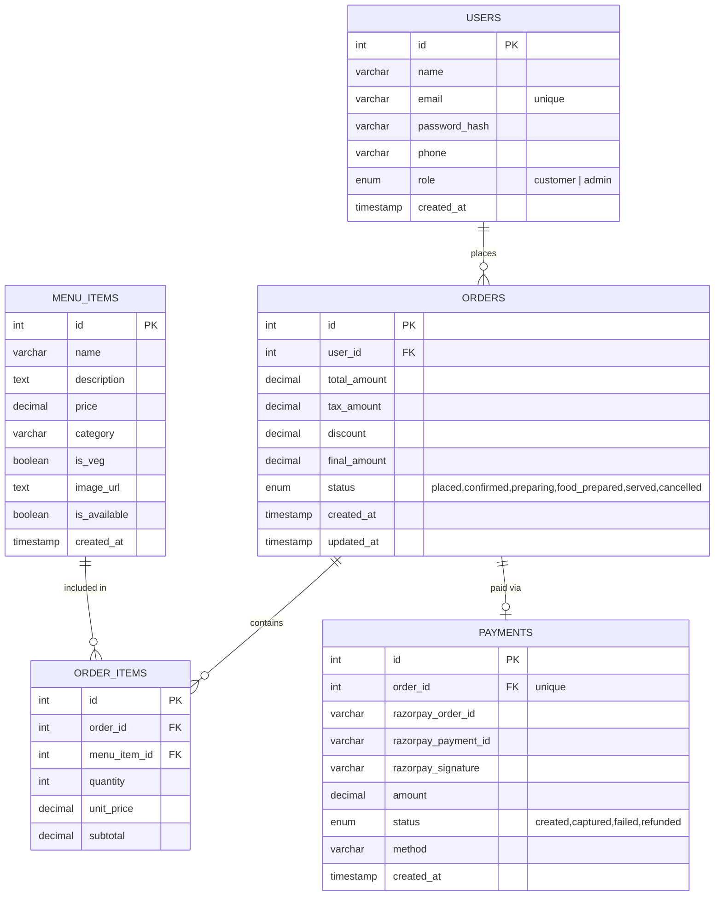
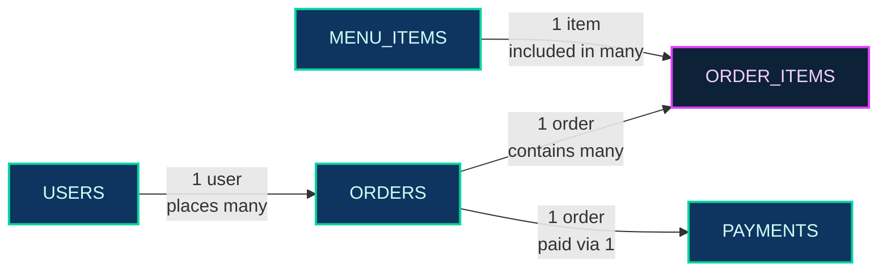

# Entity-Relationship Diagram

This diagram visualizes the 5-table normalized schema for the FoodFlash single-restaurant platform.

---

## ER Diagram (Mermaid)

---

## Schema Relationships Explained

| Relationship | Type | Description |
|---|---|---|
| USERS to ORDERS | One-to-Many (1:N) | One user can place many orders |
| ORDERS to ORDER_ITEMS | One-to-Many (1:N) | One order contains many line items |
| MENU_ITEMS to ORDER_ITEMS | One-to-Many (1:N) | One dish can appear in many orders |
| ORDERS to PAYMENTS | One-to-One (1:1) | Each order has exactly one payment record |

---

## Entity Map (Visual)

---

## Key Constraints

| Table | Constraint | Column | Rule |
|-------|-----------|--------|------|
| `users` | UNIQUE | `email` | No two users share the same email |
| `menu_items` | CHECK | `price` | `price > 0` |
| `orders` | ENUM | `status` | Only 6 valid status values |
| `orders` | TRIGGER | `final_amount` | `trg_validate_order_amount` rejects `<= 0` |
| `orders` | TRIGGER | `status` | `trg_prevent_invalid_cancel` blocks cancel after `food_prepared` |
| `order_items` | CHECK | `quantity` | `quantity > 0` |
| `order_items` | FK | `order_id` | `ON DELETE CASCADE` |
| `order_items` | FK | `menu_item_id` | `ON DELETE CASCADE` |
| `payments` | UNIQUE | `order_id` | One payment record per order |
| `payments` | FK | `order_id` | `ON DELETE CASCADE` |
