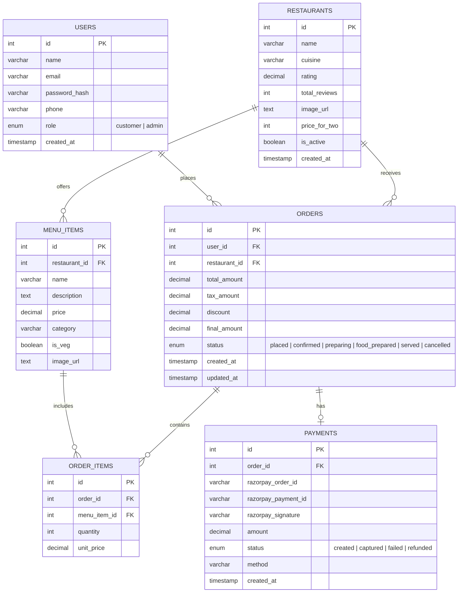

# Entity-Relationship Diagram

This diagram visualizes the 6-table normalized schema for the FoodFlash single-restaurant platform.

## Relationships Explained
- **1 User** can place **Many Orders** (`1:N`)
- **1 Restaurant** offers **Many Menu Items** (`1:N`)
- **1 Restaurant** receives **Many Orders** (`1:N`)
- **1 Order** contains **Many Order Items** (`1:N`)
- **1 Menu Item** can be part of **Many Order Items** (`1:N`)
- **1 Order** has exactly **1 Payment** (`1:1`)
