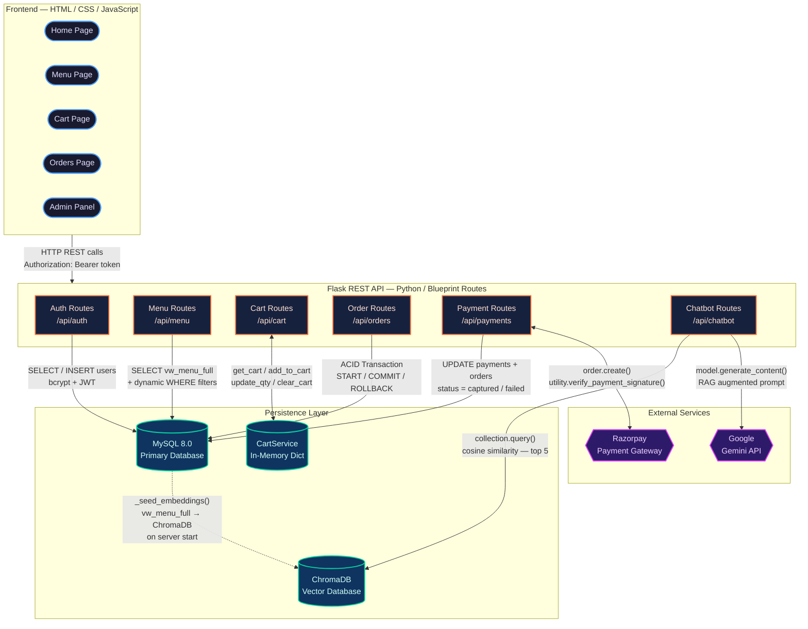

# FoodFlash System Architecture

This document provides a high-level overview of the architectural design and technologies used in the FoodFlash platform. It demonstrates the integration of multiple database paradigms across all four DBMS syllabus units.

## 1. High-Level Architecture

FoodFlash uses a **Client-Server Architecture** with a clear separation between the frontend UI, the RESTful backend, and the persistence layer.



## 2. Technology Stack Mapping to DBMS Syllabus

### Unit I: Relational Database Design
- **Technology:** MySQL 8.0
- **Implementation:**
  - A 3NF normalized schema with **5 tables** (`users`, `menu_items`, `orders`, `order_items`, `payments`).
  - No `restaurants` table — FoodFlash Kitchen is a single-restaurant system.
  - Enforcement of Primary Keys, Foreign Keys (with `ON DELETE CASCADE`), and Check constraints.
  - Two user roles: `customer` and `admin`.

### Unit II: Advanced SQL & Transactions
- **Technology:** MySQL 8.0 (Stored Procedures & Triggers)
- **Implementation:**
  - **ACID Transactions:** The order placement and payment verification flow uses `START TRANSACTION`, `COMMIT`, and `ROLLBACK` within the `place_order` and `complete_payment` stored procedures to ensure atomic inserts across 3 tables.
  - **Row-level Locking:** The `cancel_order` procedure uses `SELECT ... FOR UPDATE` to prevent race conditions.
  - **Triggers:** `trg_validate_order_amount` rejects invalid orders; `trg_prevent_invalid_cancel` blocks cancellation after food is prepared.
  - **Views:** `vw_order_details` and `vw_menu_full` power the admin dashboard and menu API respectively.
  - **Stored Procedures (x5):** `place_order`, `complete_payment`, `cancel_order`, `update_order_status`, `get_dashboard_stats`.

### Unit III: NoSQL & In-Memory Storage
- **Technology:** Python in-process dictionary (`CartService`)
- **Implementation:**
  - **Shopping Cart:** Implemented as a module-level Python dict — `{ "cart:<user_id>": { "<item_id>": {...} } }` — demonstrating key-value store concepts without Redis overhead.
  - **Key-Value Concept:** Cart keys follow a namespaced pattern identical to what Redis would use.
  - **Trade-off:** Speed of in-memory access vs. ACID durability of relational storage. Cart is session-scoped (cleared on server restart), which is acceptable for the single-restaurant demo scope.

### Unit IV: Vector Databases & RAG AI
- **Technology:** ChromaDB & Google Gemini
- **Implementation:**
  - **Embeddings:** All menu items (names, descriptions, categories) are concatenated and seeded into a local ChromaDB collection as vector embeddings.
  - **Semantic Search:** Users can query the menu using natural language (e.g., "Find me spicy non-veg options"). ChromaDB performs a cosine-similarity search.
  - **Retrieval-Augmented Generation:** The retrieved menu documents are passed as context to the Gemini LLM to construct a friendly, conversational response grounded in real menu data.

## 3. Order Processing Flow

```
1. CART (In-Memory)
   └── User adds items → CartService dict stores state per user_id

2. ORDER PLACEMENT (MySQL)
   └── place_order() stored procedure:
       ├── INSERT INTO orders
       ├── INSERT INTO order_items (xN)
       ├── INSERT INTO payments (status='created')
       └── COMMIT ← Atomic

3. PAYMENT (Razorpay)
   ├── /api/payments/create → creates Razorpay order ID
   ├── Frontend opens Razorpay checkout widget
   └── User pays → Razorpay sends back signature

4. VERIFICATION (MySQL)
   └── /api/payments/verify:
       ├── Validate Razorpay signature
       ├── UPDATE payments SET status='captured'
       ├── UPDATE orders SET status='confirmed'
       └── COMMIT ← Atomic

5. FULFILLMENT (Admin)
   └── Admin updates status: confirmed → preparing → food_prepared → served
```

## 4. Security Design

| Layer | Mechanism |
|-------|-----------|
| **Authentication** | JWT tokens (24-hour expiry) signed with `JWT_SECRET` |
| **Authorization** | `@token_required` and `@admin_required` Flask decorators |
| **Password Storage** | bcrypt hashing (never stored in plaintext) |
| **Payment Security** | Razorpay HMAC-SHA256 signature verification on the backend |
| **SQL Injection** | Parameterized queries (`%s` placeholders) throughout |
| **CORS** | Flask-CORS configured to allow frontend origin |

## 5. File Structure Summary

```
backend/
├── app.py                  → Flask app factory, blueprint registration
├── config.py               → Env var loading (no Redis vars)
├── routes/
│   ├── auth_routes.py      → JWT login/register/profile
│   ├── menu_routes.py      → Menu listing, search, single item
│   ├── cart_routes.py      → In-memory cart CRUD
│   ├── order_routes.py     → ACID order placement & cancellation
│   ├── payment_routes.py   → Razorpay create & verify
│   ├── admin_routes.py     → Admin stats, order mgmt, menu CRUD
│   └── chatbot_routes.py   → RAG chatbot endpoint
├── services/
│   ├── cart_service.py     → In-memory CartService (key-value)
│   ├── rag_service.py      → ChromaDB + Gemini RAG pipeline
│   └── razorpay_service.py → Razorpay stub
└── utils/
    ├── auth.py             → JWT helpers, decorators
    └── db.py               → MySQL connection pool
```
